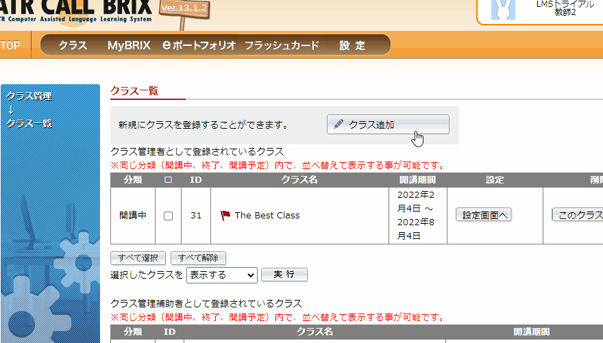

# The English Brix Guide to Greatness 

## Now with GIFs!

## Loging In

Log in with your credentials.

Once logged in, click on the 'gears' at the top right of the screen.

In the dropdown menu, click on the button クラス管理 (Classroom/Class management).

## Making a Class

### Naming and Making

1. Click on the クラス追加 button in the top middle of the page.
2. Enter the name of your class and select when your class will start and finish
3. After your satisfied with your choices, click the　登録 button.

### Adding students

1. From the class dashboard (the place where you can see your newly created class)
2. Click the 設定画面へ button
3. Click on the button labeled メンバー管理 near the top of the screen

Here is where you will be able to add and remove students from youru class.

To search for and add a student to your class.

1. Click the first button, メンバ追加
2. From the drop down menu, choose how you would like to search for your student (eg. by ID - ユーザーID). You can use the other drop down boxes to narrow your search if necessary.
3. Type in the user id and click 検索 at the bottom of the list
4. A list will be created, and you should hopefully see the student(s) that you searched for
5. Click the little box next to the student ID then click the **first** 追加
6. Your student is now in your class

### Adding the Learning Material

1. From your クラス情報設定 (The page with all the buttons), click on コース設定, the button bellow the user button (ユーザー追加)
2. Click コースを選択 to look at all the avaliable courses

_there will be a warning that will pop-up. Don't worry, it just says "Oh by the way you only have the option of choosing two kinds of learning materials", but less gently_

3. You will see all avaliable learning materials 
4. Find the course you want and click the 選択 button
5. Click the　共有 button and accept the warning that pops up

### Adding Due Dates

The Brix system allows the teacher to time periods for when the student is able to do a particular moduel or section. 

The amount of sections and the section type (test, lesson, etc.) varries.

1. From クラス情報設定, click the third button コース実施画面
2. From the drop down menu, find the course (learning materials) you would like to set-up
3. click the ユニット表示 button on the far right
4. Each unit is displayed in relative order
5. If the list is too long, you can shorten it by using the second drop down menu next to the drop down menu you used to select the learning materials
6. Once you have a list you can work with, click the calender icon for the respective unit and choose the start and end date for each unit 
7. Once you are finished, click the 登録 button near the bottom of the page

### Adding Goals

The Brix system requires goals for each course/learning material you selected.

#### Progress Goal

1. Again from your クラス情報設定 page, click on 公式目標設定
2. At the top of the page, click the calender button and choose the end date for your course
3. Bellow that, put the desired percentage of completion you would like your students to achieve (eg. 100 for 100% of the course completed)
4. Click the すべて選択 button to select all the units/parts of the learning material, then move on to the next part

#### Grade Goal

1. Just like you did for the progress goal, choose the end date you want your students to acheive their grade / score / result goal
2. In the box bellow the date, type in the percentage of correct answers you want your students to acheive
3. The drop down box to the left of the 'point' box is where you can choose 平均 (cumulative adverage) or 最低 (minimum score). I (Justin) assume that the fumulative adverage setting will accept a wide reange of fantastic and terrible grades. Whereas the minimum score measurement wont mark a unit as **passed** if they got a terrible grade on a specific unit
4. Simmilar to when you set the progress goal, click すべて選択 to select all the units
5. Finally click the 登録 button and click all the red pop-up buttons

## <i>And your done!<i>
